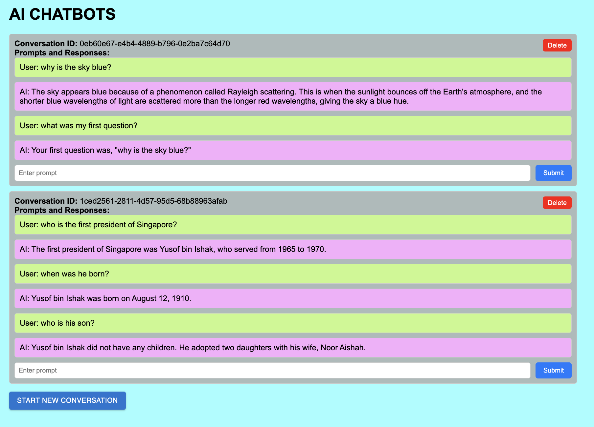

# LLM Frontend

This is a front-end component for chatting with a Large Language Model (LLM). It allows users to interact with the LLM hosted on llm_backend. 



## Requirements

To run this project, you will need the following technologies:

- NodeJS >= 18.17
- NextJS 13
- React 18
- Mantine 6
- React-Query 4

## Installation

To install the required dependencies, run the following command:

```bash
npm install
```

```bash
npm install @mui/material
npm install @emotion/react
npm install @emotion/styled
```

Usage
To start the development server, run:

```bash
npm run dev
```

This will run the application in development mode. Open http://localhost:3000 to view it in the browser.
